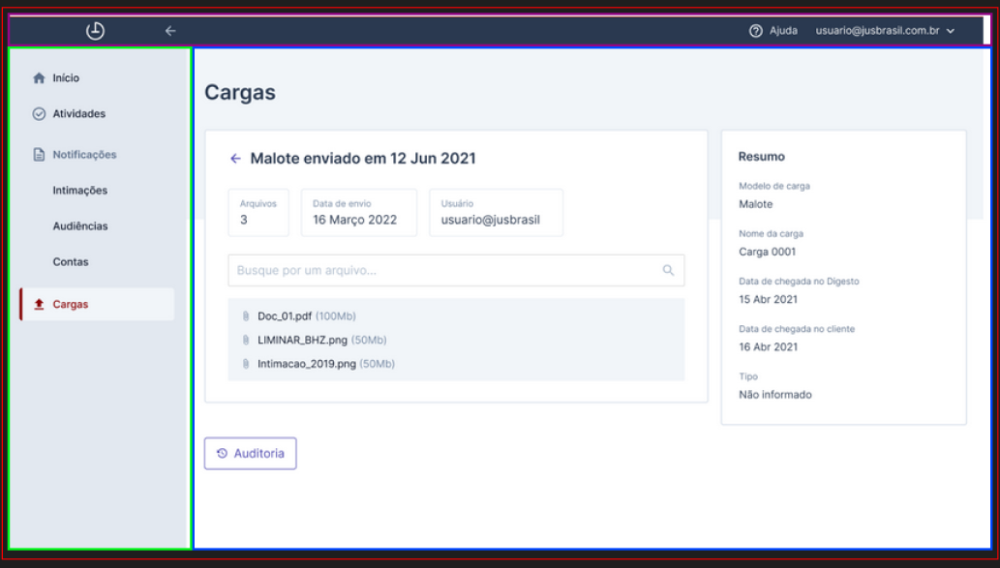

# Proposta arquitetura Digesto

Esse projeto consite em uma proposta de arquitetura de uma aplicação frontend escrita em React para a aplicação Digesto.

## Estrutura de pastas

Aplicação composta pelas seguintes pastas:

- `src`
  - `adapters`: implementa as interfaces definidas na pasta `ports`
  - `components`: componentes mais genéricos
  - `config`: arquivos de configuração
  - `e2e`: testes end-to-end
  - `factories`: criação dos serviços
  - `hooks`
  - `layouts`: estrutura de páginas
  - `pages`: além da página pode conter componentes específicos desta página
  - `ports`: interfaces de comunicação com o meio externo
  - `services`: chamadas para api
  - `types`: tipos de dados
  - `utils`: funções que podem ser reaproveitadas

## Componentização

